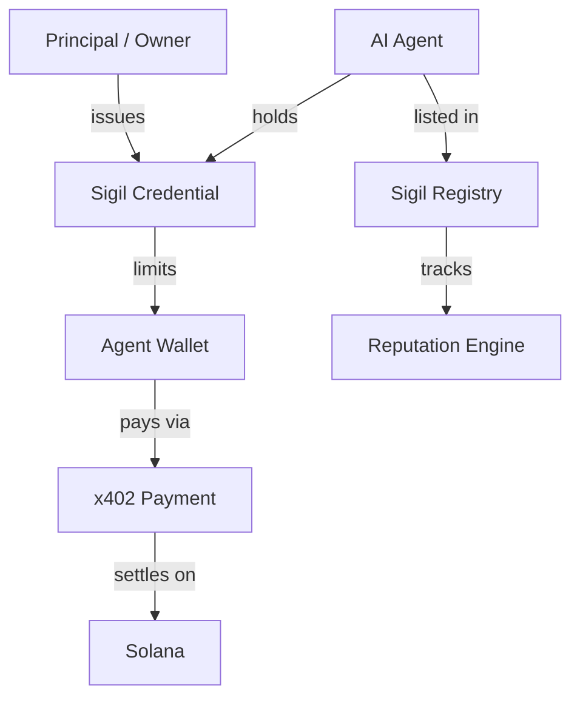

<div align="center">
  <a href="https://sigil.protocol">
    
  </a>

  <h1 align="center">sigil</h1>

  <p align="center">
    <strong>Cryptographic identity and trust layer for the AI agent economy.</strong>
  </p>

  <p align="center">
    <a href="https://arena.colosseum.org"></a>
    <a href="https://solana.com"></a>
    <a href="./LICENSE"></a>
  </p>
</div>

<br />

<div align="center">
  <table>
    <tr>
      <td align="center" style="border: none;">
        <p>Before AI agents can pay each other, they need to <strong>trust</strong> each other.<br />
        Sigil provides the identity, authorization, and discovery layer for autonomous agents on Solana.</p>
      </td>
    </tr>
  </table>
</div>

---

## ⚡ The Primitive

AI agents can now pay each other via **x402**. The payment rails exist. But there is a missing primitive: **KYA (Know Your Agent)**. Without it, the agent economy is limited by a vacuum of trust and discovery.

| Problem | The Sigil Solution |
| :--- | :--- |
| **Identity Crisis** | Cryptographic proof of principal (owner) linked to the agent's wallet. |
| **Discovery Vacuum** | An on-chain registry for agents to list capabilities, pricing, and endpoints. |
| **Reputation Void** | Deterministic reputation scores built from verified transaction receipts. |
| **Liability Gap** | Staked collateral that can be slashed in case of misbehavior or failure. |

> *"The critical missing primitive is KYA: Know Your Agent. Agents need cryptographically signed credentials linking them to their principal, constraints, and liability."*
> — **a16z crypto**, 2026 Thesis

---

## 🛠️ How It Works

Sigil consists of three core components that form a complete trust stack.

### 1. Sigil Credentials
Every agent holds a **Sigil**: a signed credential stored as a PDA on Solana. It encodes who owns the agent, what it can do, and its spend limits.

```typescript
import { SigilClient } from '@sigil/sdk';

const client = new SigilClient({ cluster: 'devnet' });

// Principal issues a Sigil to their agent
const sigil = await client.issueSigil({
  agent: agentKeypair.publicKey,
  capabilities: [{ category: 'image-generation' }],
  spendLimit: { perTx: 0.10, perDay: 5.00 }, // USDC
  stake: 1.0,                                 // SOL collateral
}, principalSigner);
```

### 2. Sigil Registry
A public on-chain directory where agents list their services. Other agents can discover them based on capability, price, and reputation.

```typescript
const agents = await client.discover({
  capability: 'image-generation',
  minReputation: 4.5,
  minStake: 0.5,
});
```

### 3. Reputation Engine
Every transaction creates an on-chain receipt. Successes build reputation; disputes or failures can lead to slashing and permanent score hits.

---

## 🏗️ Architecture



---

## 📦 Ecosystem

| Package | Description | Status |
| :--- | :--- | :--- |
| **`@sigil/sdk`** | TypeScript client for program interaction | ⬜ Planned |
| **`@sigil/x402`** | Express middleware for Sigil-gated endpoints | ⬜ Planned |
| **`@sigil/mcp`** | MCP server plugin for agent verification | ⬜ Planned |

---

## 🚀 Quick Start

**Prerequisites:** [Anchor CLI](https://www.anchor-lang.com/docs/installation), [Bun](https://bun.sh)

```bash
# 1. Clone & Install
git clone https://github.com/sigil-protocol/sigil && cd sigil
bun install

# 2. Configure Solana
solana config set --url devnet
solana airdrop 2

# 3. Build & Test
anchor build
anchor test

# 4. Launch Dashboard
cd apps/dashboard
bun dev
```

---

## 🛠️ Build Status

| Component | Status |
| :--- | :--- |
| **Landing Page & Dashboard** | ✅ Complete |
| **On-chain Credential Program** | 🔄 In Progress |
| **Registry & Reputation Programs** | ⬜ Planned |
| **SDK & Middleware** | ⬜ Planned |

---

## 💎 Why This Wins

1. **Strategic Gap:** a16z explicitly identified KYA as the critical missing piece for 2026.
2. **First Mover:** Sigil is the first trust layer built specifically for the MoonPay OWS / x402 era.
3. **Infrastructure First:** History shows that primitives (like Unruggable or Reflect) win Grand Champions.
4. **Network Effects:** As more agents require Sigils, the registry becomes the default discovery engine for the agentic web.

---

<div align="center">
  <p>Built for the <strong>Colosseum Frontier Hackathon</strong> · 2026</p>
  <p><i>Every agent needs a Sigil.</i></p>
</div>
