<div align="center">
  
</div>

<br/>

<div align="center">

[](https://arena.colosseum.org)
[](https://solana.com)
[](https://www.anchor-lang.com)
[](https://www.typescriptlang.org)
[](./LICENSE)
[]()

</div>

<br/>

<div align="center">

**Before AI agents can pay each other, they need to trust each other.**
**Sigil is the cryptographic identity, trust, and discovery layer for the agent economy on Solana.**

</div>

---

## The Problem

AI agents can now pay each other via [x402](https://www.x402.org) on Solana. The payment rails exist. But there's no trust layer — and without it, the agent economy can't scale.

| Problem | What it means |
|---------|---------------|
| **Identity crisis** | An agent claiming to be "Company X's service" could be anyone. No cryptographic proof of principal. |
| **Discovery vacuum** | Agents can't find each other. No marketplace, no directory. $28K daily x402 volume is not demand-limited — it's discovery-limited. |
| **Reputation void** | No way to know if an agent is reliable. No consequences for bad behavior. No stake at risk. |
| **Liability gap** | When an agent misbehaves, who pays? Corporations won't deploy agents they can't bound liability on. |

> *"The critical missing primitive is KYA: Know Your Agent. Just as humans need credit scores, agents need cryptographically signed credentials linking them to their principal, constraints, and liability."*
> — a16z crypto, 2026 thesis

**Sigil is that primitive.**

---

## How It Works

Sigil has three components that together form a complete trust layer.

### 1. Sigil Credentials — Identity + Authorization

Every agent holds a **Sigil**: a signed credential stored as a PDA on Solana.

```typescript
import { SigilClient } from '@sigil/sdk';

const client = new SigilClient({ cluster: 'devnet', rpcUrl: HELIUS_URL });

// Principal issues a Sigil to their agent
const sigil = await client.issueSigil({
  agent: agentKeypair.publicKey,
  capabilities: [{ category: 'image-generation', allowedDomains: ['api.openai.com'] }],
  spendLimit: { perTx: 0.10, perDay: 5.00 }, // USDC
  stake: 1.0,                                  // SOL collateral
  expiresIn: '90d',
}, principalSigner);
```

The Sigil encodes: **who owns the agent**, **what it can do**, **how much it can spend**, and **what collateral it has staked**. The principal can revoke it instantly.

### 2. Sigil Registry — Discovery

A public on-chain directory where agents list their capabilities, pricing, and endpoint.

```typescript
// Any agent can discover others
const agents = await client.discover({
  capability: 'image-generation',
  maxPrice: 0.10,          // USDC per call
  minReputation: 4.0,      // out of 5
  minStake: 0.5,           // SOL
});

// Pay + call via x402 with Sigil verification built in
const result = await client.callAgent(agents[0], { prompt: 'a cat' });
```

### 3. x402 Middleware — Gated Endpoints

Any Express server can gate access by requiring a valid Sigil.

```typescript
import { requireSigil, x402Payment } from '@sigil/x402';

app.post('/api/generate',
  requireSigil({ minReputation: 3.5, requiredCapability: 'image-generation' }),
  x402Payment({ amount: 0.05, currency: 'USDC' }),
  handler,
);
// req.sigil is populated with verified agent data
```

---

## Architecture

```
┌─────────────────────────────────────────────────────────┐
│              PRINCIPAL (Human / Company)                  │
└──────────────────────────┬──────────────────────────────┘
                           │ issues Sigil
                           ▼
┌─────────────────────────────────────────────────────────┐
│                      AI AGENT                             │
│    ┌──────────────┐          ┌────────────────────────┐  │
│    │    Wallet    │◄─────────│        Sigil           │  │
│    │  (Privy OWS) │          │  (identity + limits)   │  │
│    └──────────────┘          └────────────────────────┘  │
└───────────────┬─────────────────────┬────────────────────┘
                │ transacts via        │ listed in
                ▼                     ▼
  ┌─────────────────────┐   ┌──────────────────────────┐
  │    x402 Payment     │   │     Sigil Registry       │
  │  @sigil/x402        │   │  (discovery + reputation)│
  └──────────┬──────────┘   └──────────────────────────┘
             │ settles on
             ▼
  ┌─────────────────────┐
  │    Solana Devnet    │
  └─────────────────────┘
```

### On-chain Programs

| Program | Purpose | PDA Seeds |
|---------|---------|-----------|
| **Credential** | Issue, update, revoke Sigils | `["sigil", agent_pubkey]` |
| **Registry** | Agent listings + discovery | `["listing", sigil_pda]` |
| **Reputation** | Transaction receipts + scores | `["receipt", tx_sig]` |

### npm Packages

| Package | Description |
|---------|-------------|
| `@sigil/sdk` | TypeScript client for all three programs |
| `@sigil/x402` | Express middleware for Sigil-gated endpoints |
| `@sigil/mcp` | MCP server plugin for agent verification |

---

## Repository Structure

```
sigil/
├── programs/
│   ├── credential/         # Anchor: issue_sigil, revoke_sigil, record_spend
│   ├── registry/           # Anchor: list_agent, update_listing
│   └── reputation/         # Anchor: create_receipt, submit_rating
├── packages/
│   ├── sdk/                # @sigil/sdk
│   ├── x402-middleware/    # @sigil/x402
│   └── mcp-plugin/         # @sigil/mcp (planned)
├── apps/
│   └── dashboard/          # Next.js 15 — principal dashboard + registry explorer
├── Anchor.toml
└── package.json            # bun workspaces
```

---

## Tech Stack

| Layer | Technology | Reason |
|-------|-----------|--------|
| Smart contracts | Anchor (Rust) | Solana standard, partner support |
| RPC | Helius | Free tier, webhooks, best DX |
| Wallet | Privy (Open Wallet Standard) | Embedded wallets, fast onboarding |
| Frontend | Next.js 15 + TypeScript | App Router, RSC, strict mode |
| UI | Tailwind v4 + shadcn/ui | Fast, accessible, hackathon-friendly |
| Animations | Framer Motion v11 | `useScroll`, `useTransform`, variants |
| SDK runtime | Bun | Fast installs, native TypeScript |
| Hosting | Vercel (frontend) + Render (indexer) | Zero-config deploy |

---

## Quick Start

**Prerequisites:** Rust, [Anchor CLI](https://www.anchor-lang.com/docs/installation), Solana CLI, [Bun](https://bun.sh)

```bash
# 1. Clone
git clone https://github.com/sigil-protocol/sigil
cd sigil

# 2. Install Anchor CLI
cargo install --git https://github.com/coral-xyz/anchor avm --locked
avm install latest && avm use latest

# 3. Install JS deps
bun install

# 4. Configure Solana for devnet
solana config set --url devnet
solana-keygen new --outfile ~/.config/solana/id.json   # skip if you have one
solana airdrop 2

# 5. Build and test programs
anchor build
anchor test

# 6. Run the dashboard
cd apps/dashboard
cp .env.example .env.local   # fill in your Helius RPC URL + program IDs
bun dev
```

Open [http://localhost:3000](http://localhost:3000).

---

## Build Status

| Component | Status | Notes |
|-----------|--------|-------|
| Landing page | ✅ Complete | Framer Motion animations, scroll reveal |
| Principal Dashboard | ✅ Complete | Mock data — Solana wiring pending |
| Registry Explorer | ✅ Complete | Client-side filter + sort |
| Sigil Detail + Revoke | ✅ Complete | AlertDialog, spend bar animation |
| Agent Profile + Reputation Chart | ✅ Complete | Recharts AreaChart |
| Credential Program | 🔄 In progress | `issue_sigil`, `revoke_sigil`, `record_spend` |
| Registry Program | ⬜ Not started | `list_agent`, `update_listing` |
| Reputation Program | ⬜ Not started | `create_receipt`, `submit_rating` |
| `@sigil/sdk` | ⬜ Not started | TypeScript wrapper |
| `@sigil/x402` | ⬜ Not started | Express middleware |
| Dashboard → real Solana | ⬜ Not started | Replace mocks with live RPC |
| Demo agents (A + B) | ⬜ Not started | End-to-end transact demo |

---

## Why This Wins

1. **a16z explicitly named this gap** — KYA is the missing primitive, and they said "months to figure out"
2. **No competitors have shipped** — the wallet layer (MoonPay OWS) arrived March 2026, but the trust layer doesn't exist yet
3. **Infrastructure primitives win Grand Champions** — Unruggable, TapeDrive, and Reflect all won by shipping primitives
4. **MCPay momentum** — judges at Colosseum are primed for MCP + x402 thesis; Sigil extends it with identity
5. **Network effects moat** — once integrated into x402 endpoints, switching cost becomes high

---

## Contributing

See [CONTRIBUTING.md](./CONTRIBUTING.md) for setup, rules, and conventions.

Key rules:
- **Bun only** — no `npm` or `yarn`
- **TypeScript strict** — no `any`
- **Never commit secrets** — use `.env.local` (gitignored)
- **No direct commits to `main`** — branch + PR

---

## Docs

| File | Contents |
|------|----------|
| [idea.md](./idea.md) | Full product concept + KYA model |
| [architecture.md](./architecture.md) | On-chain program design + SDK interfaces |
| [build-plan.md](./build-plan.md) | 3-week daily execution plan |
| [tasks/todo.md](./tasks/todo.md) | Implementation checklist (current progress) |
| [research.md](./research.md) | Market research — a16z thesis, x402, agent wallets |
| [startup-potential.md](./startup-potential.md) | Business model, competition, moat |
| [hackathon.md](./hackathon.md) | Colosseum Frontier submission requirements |

---

<div align="center">

Built for [Colosseum Frontier Hackathon](https://arena.colosseum.org) · Apr – May 2026

*Every agent needs a Sigil.*

</div>
